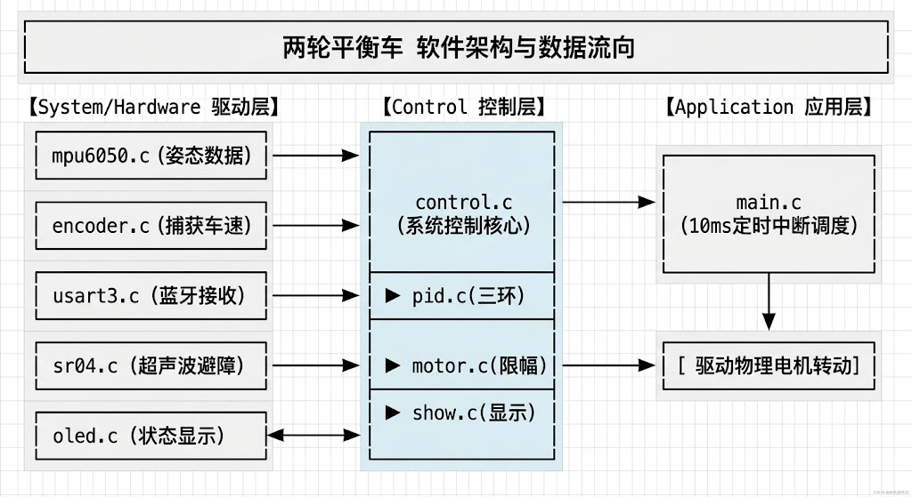
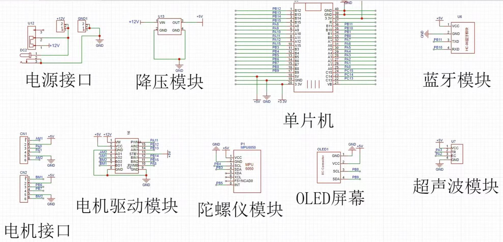

## 一、 系统程序架构与文件逻辑关系

工程采用了非常清晰的**分层架构**。各文件夹之间的依赖与数据流向如下：



- **System/Hardware（硬件驱动层）**：只负责将底层硬件信息转化为标准物理量。例如 `mpu6050.c` 只输出角度和陀螺仪值，不参与任何控制计算。
- **Control（控制层）**：整个小车的大脑。`control.c` 从驱动层拿数据，传给 `pid.c` 计算，最后把计算结果通过 `motor.c` 打给硬件驱动。
- **Application（应用逻辑层）**：负责最高级别的宏观调度，通过定时器中断维持系统运行的生命周期。
## 二、 硬件接口与单片机资源对照表

为了让软件顺利驱动硬件，STM32 内部资源（Timer/USART/I2C/GPIO）的分配必须严格对照硬件引脚。以下为标准平衡车硬件接口映射表：

| **模块名称**          | **物理引脚（示例）**                   | **单片机内部资源**            | **配置要点 / 避坑点**                                                 |
| ----------------- | ------------------------------ | ---------------------- | -------------------------------------------------------------- |
| **MPU6050软件 I2C** | `PB4(SCL)`, `PB3(SDA)`         | 普通 GPIO 开漏输出           | 模拟 I2C，`IIC.c`中实现。不需要开启硬件I2C，方便移植。                             |
| **MPU6050中断**     | `PA4 (INT)`                    | `EXTI4` 外部中断           | 触发方式设为**下降沿触发**，以此作为控制循环的基准。因为是dmp库，看采样率100hz，所以中断10ms为周期。     |
| **电机 PWM**        | `PA8`, `PA11`                  | `TIM1_CH1`, `TIM1_CH4` | 定时器配置为 **PWM Generation**，频率设为 $10\text{kHz}$，防止产生人耳能听到的电机啸叫声。 |
| **电机方向引脚**        | `PB12`, `PB13`, `PB14`, `PB15` | 普通 GPIO 推挽输出           | 控制电机正反转。                                                       |
| **左编码器**          | `PA0`, `PA1`                   | `TIM2` (Encoder Mode)  | 开启**编码器模式 (Combined Channels)**，双沿计数以提高精度。                     |
| **右编码器**          | `PA6`, `PA7`                   | `TIM3` (Encoder Mode)  | 同上，注意方向正负的匹配。                                                  |
| **OLED 屏幕**       | `PB8(SCL)`, `PB9(SDA)`         | 硬件/软件 I2C              | `oled.c` 负责刷新。                                                 |
| **超声波 SR04**      | `PB3(Trig)`, `PB2(Echo)`       | 普通 GPIO + 定时器输入捕获      | `Trig` 触发引脚，`Echo` 接收引脚（利用定时器测高电平时间）。                          |
| **蓝牙通讯**          | `PB10(TX)`, `PB11(RX)`         | `USART3` 异步串口          | 开启**串口接收中断**，用于在线无线调参。                                         |



**PS:**
**一、电机转动配置（PWM）**
**1. 配置原理**
单片机通过定时器产生高频的方波（通常 $10\sim20\text{kHz}$）。通过改变方波中高电平所占的比例（即**占空比**），来控制电机两端的平均电压，从而控制转速。
- **方向控制**：一般配合驱动芯片（如 TB6612 或 A4950），使用两个普通的 GPIO 引脚（例如 `AIN1`, `AIN2`）控制正反转：
    - `AIN1 = 1, AIN2 = 0` $\rightarrow$ 正转
    - `AIN1 = 0, AIN2 = 1` $\rightarrow$ 反转
- **速度控制**：将 PWM 引脚接到驱动芯片的使能端（`PWMA`），占空比越大，转得越快。
**2. CubeMX 配置要点**
1. 选择一个定时器（例如 `TIM3`），将对应的通道（如 `Channel 1`, `Channel 2`）设置为 **PWM Generation CHx**。
2. **频率计算**：STM32F103 的定时器主频一般是 $72\text{MHz}$。
    - 设定预分频系数（Prescaler, PSC）为 `0`（即 $1$ 分频：$72\text{MHz} / 8 = 9\text{MHz}$）。
    - 设定自动重装载值（Counter Period, ARR）为 `7199`（即计 $7200$ 个数）。
    - 最终 PWM 频率 = $\frac{72000000}{1 \times 7200} = 10000\text{Hz} = 10\text{kHz}$。
3. 在代码中控制速度：
    ```
    // 修改 TIM3 通道 1 的占空比为 3600（50% 速度）
    __HAL_TIM_SET_COMPARE(&htim3, TIM_CHANNEL_1, 3600); 
	```
**二、MPU6050配置**
**1. `PB3` (SDA) 和 `PB4` (SCL) —— 模拟 I2C 引脚**
在 CubeMX 中，这两个引脚都应当配置为普通的 **GPIO 输出模式**：
- **SCL (`PB4`) 配置**：
    - **GPIO mode**：`GPIO_Output`（输出模式）
    - **GPIO Output Level**：`low`
    - **Output speed**：`low`
    - **GPIO Pull-up/Pull-down**：`No pull-up and no pull-down`
- **SDA (`PB3`) 配置**：
    - **GPIO mode**：`GPIO_Output`（因为模拟 I2C 需要软件控制引脚时而输出、时而读取输入，因此通常在代码中会通过寄存器动态切换该引脚的输入/输出方向；或者直接将其配置为 **开漏输出（Open-Drain）**，这样就无需频繁切换方向，直接读取即可）
    - **GPIO Output Level**：`low` 程序里面可以改
    - **GPIO Mode**：`No pull-up and no pull-down`
	SDA两种情况：  
	1、配置成推挽输出-->需要切换输入输出模式  
	2、配置成开漏输出-->不需要切换
	一定条件下：1.从机严格遵守iic协议，2.在读ack之前，主机设置为输入模式，3.无多主机iic的情况下。模拟iic是可以用推挽输出来实现的，也不会短路。
	当要考虑异常情况，比如数据没传完的时候主机复位了、主机和从机不是同一个电源，或者电容导致下电时间不一致实可能会短路。
**2. `PB5` (INT) —— 陀螺仪数据中断引脚**
- **外部中断法**
    - **GPIO mode**：`GPIO_EXTI5`（外部中断 5）
    - **GPIO mode (EXTI)**：`External Interrupt Mode with Falling edge trigger detection`（下降沿触发中断）
    - **NVIC 中断使能**：在 NVIC 选项卡中勾选 `EXTI line[9:5] interrupts`。
## 三、 核心硬件模块构建与核心机制

### 1. MPU6050 与软件 I2C (`IIC.c`, `mpu6050.c`, `inv_mpu.c`)

- **核心机制**：通过软件模拟 I2C 的时序读出 MPU6050 的原始加速度和角速度，再通过官方 DMP 固件库 (`inv_mpu.c`) 直接解算出平滑的 Pitch（俯仰角）和 Gyro（陀螺仪角速度）。
- **注意**：**机械中值 (`Middle_angle`) 手动校准**。
### 2. 电机控制 (`motor.c`)
- **核心机制**：通过修改定时器的比较寄存器（如 `__HAL_TIM_SET_COMPARE`）来改变 PWM 占空比，控制速度；通过控制 GPIO 的高低电平控制正反转。
- **注意（硬件保护）**：**做软件死区与硬限幅**。STM32 的 PWM 最大计数值如果是 7200，当 PID 算出来的输出超过 7200 时，必须在 `motor.c` 的 `Limit()` 函数中强行截断到 $\pm 7000$。否则严重的过载会瞬间烧毁 TB6612 或 A4950 驱动芯片。
### 3. 编码器速度捕获 (`encoder.c`)
- **核心机制**：利用定时器的硬件编码器模式，在每个控制周期（10ms）去读取计数器的值，读完后**立刻将计数器清零**（`__HAL_TIM_SET_COUNTER(&hadc, 0)`）。当前读取的值就是小车在这 10ms 内走过的物理距离（代表速度）。
- **注意**：**方向一致性**。必须保证小车前行时，左右编码器读数**同为正数**；后退时，**同为负数**。如果右轮编码器反了，需要在软件里对读数乘以 `-1`。
### 4. OLED 刷新 (`oled.c`, `show.c`)
- **核心机制**：将调参数据、电压数据转换为字符串并写入屏幕。
- **注意**：**绝对不要在 10ms 的控制中断里调用 OLED 刷新函数**I2C 刷新屏幕的耗时极长（通常需要几毫秒甚至十几毫秒），如果在控制中断里刷新屏幕，会导致整个 PID 周期被严重拉长。
### 5. 超声波测距 (`sr04.c`)
- **核心机制**：给 `Trig` 引脚一个 10us 的高电平脉冲，模块发出超声波。当 `Echo` 变高电平时开启定时器，变低电平时关闭定时器，根据高电平持续时间计算物理距离。
- **避坑点**：超声波检测具有**阻塞性**（如果前面很远没有障碍物，`Echo` 会等待很久才返回低电平）。在平衡车中，建议采用**定时器输入捕获中断**或者**非阻塞定时器计数**的方式读取，避免死等待。
## 四、 控制算法逻辑与核心控制流程
平衡车的算法（直立环、速度环、转向环）已经非常成熟，我们一笔带过其数学原理，**重点剖析其精密的控制流程和嵌套结构**。
### 1. 核心控制总流程图（10ms 定时器中断 / MPU6050 中断）
整个平衡车的控制生命周期全部浓缩在 `control.c` 的 `Control()` 函数中，每 10ms 严格执行一次：
```
[ 触发 10ms 中断 / EXTI中断 ]
           │
           ▼
┌──────────────────────────────────────┐
│ 1. 采集数据                           │ ◄─ 读取 MPU6050 角度/角速度
│    Read_MPU6050_Data();              │ ◄─ 读取 左右编码器原始脉冲值
└──────────────────────────────────────┘
           │
           ▼
┌──────────────────────────────────────┐
│ 2. 安全检查                           │
│    Pick_Up();  /  Put_Down();        │ ◄─ 判断小车是否悬空或倒地
└──────────────────────────────────────┘
           │
           ├─── [小车倒地/被提起 (Flag_Stop == 1)] ──► 强行熄火: PWM = 0; 积分清零;
           │                                            
           └─── [正常站立状态 (Flag_Stop == 0)]
                       │
                       ▼
          ┌──────────────────────────────────────┐
          │ 3. 速度环计算 (PI)                    │
          │    Velocity_out = ...                │ ◄─ 采用一阶低通滤波减少机械噪声
          └──────────────────────────────────────┘
                       │
                       ▼
          ┌──────────────────────────────────────┐
          │ 4. 直立环计算 (PD)                    │
          │    Vertical_out = ...                │ ◄─ 将速度环输出作为目标角度的输入
          └──────────────────────────────────────┘
                       │
                       ▼
          ┌──────────────────────────────────────┐
          │ 5. 转向环计算 (PD)                    │
          │    Turn_out = ...                    │ ◄─ 结合遥控指令计算差速
          └──────────────────────────────────────┘
                       │
                       ▼
          ┌──────────────────────────────────────┐
          │ 6. 融合与物理输出                     │
          │    PWM_L = Vertical + Velocity - Turn│
          │    PWM_R = Vertical + Velocity + Turn│
          │    Limit();  ──►  Load_PWM();        │ ◄─ 安全限幅后，改写寄存器驱动电机
          └──────────────────────────────────────┘
```

### 2. 串级pid嵌套的关键点
- **数据低通滤波**：速度环的输入（左右编码器读数之和）**必须经过一阶互补低通滤波**：
    $$\text{Encoder\_Filtered} = 0.7 \times \text{Encoder\_Last} + 0.3 \times \text{Encoder\_Now}$$
    如果不加滤波，电机的机械抖动通过编码器直接传给速度环，速度环又瞬间改变 PWM，会引发整车的硬件共振，小车会发出刺耳的“嘎嘎”声并剧烈颤抖。
## 五、 串口蓝牙通讯与无线调参逻辑 (`usart3.c`)
在线调参是平衡车调试成功与否的分水岭。通过蓝牙动态修改 `pid.c` 中的 $K_p, K_d$ 参数，效率比反复烧录代码高 100 倍。
1. **注意app要求整型数据**：在手机 APP 端发送数据时，记得把所有浮点数参数（如 `0.065`）统一**乘以 1000 变成整数**（`65`）再发出。单片机接收后通过 `Final_Param = Data / 1000.0f;` 还原。
2. **防止缓存区数据溢出**：由于乘以 1000 变成整数，多个数据可能导致缓冲区溢出，导致数据缺失。可以适当调整乘以倍数。
3. **通信与中断优先级**：串口接收中断的优先级**必须低于** MPU6050 外部中断或控制定时器中断。必须保证控制小车平衡的 10ms 中断永远拥有最高的执行优先级，否则蓝牙发送大流量数据时，一旦卡住控制中断，小车就会瞬间瘫痪跌倒。